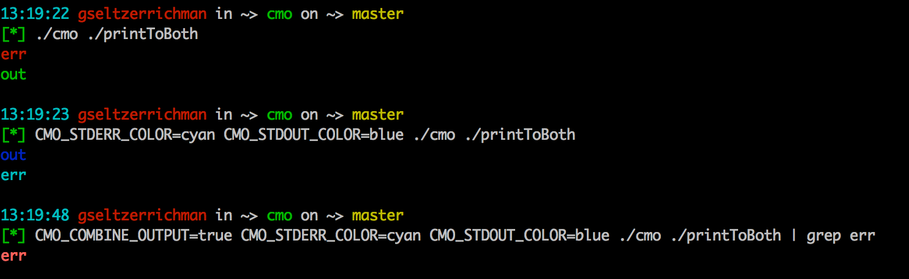

# CMO 
### Colorize my output

cmo color-code the stdout/stderr of the command that's passed after it. These colors can be set by environment variables:

`CMO_STDOUT_COLOR` (default: green)

`CMO_STDERR_COLOR` (default: red)

`CMO_COMBINE_OUTPUT` (default: false) - print both stdout and stderr to stdout 

`CMO_VERBOSE` (default: false)

Your color options are: red, blue, green, yellow, cyan, black

  

Enjoy, feel free to make an issue for bugs, or feature requests

  

